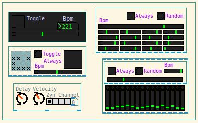

Hyacinth Macaw
==============

The hyacinth macaw (Anodorhynchus hyacinthinus), or hyacinthine macaw, is
a parrot native to central and eastern South America.

Sequenciador para Zynaddsubfx MIDI Synthesizer

The Compound
==============
To use the a_compound is really simple. To create one you type ctrl+1 and type inside the box a_compound this is a compound to make sound trought Zynaddsubfx or any other midi synthetizer you might prefer. But this one needs to be able to make connection with Puredata using Jack Routing. I am saying that because I do not know other ways to make that happen. So, ok. The colored grid is a grid with 0's and 1's this grid will toggle the sequencer, so you can make combinations fast. The grid have a simple meckanism to randomize the matrix, so you can do combinations more quickly. The principle of the randomize was used often on the a_compound. The Box Delay, Velocity, Channel is a box to control the makenote object (pd's native), quite simple right ? The randseq is a box to make random values to the sequencer multiplications its another way to make combinations and create diferente compositions. The box bellow its a box to start the compound, it contains a simple bpm that set values from 750 (left) to 122 (right). The left is a keyboard with 16 keys, each key have from 1 to 127 midinotes, each key also have a upper led signalling that the key are being played or not. This piano have at his top a meckanism to make random note positions and to make this continously (with a metronome). Easy to use.

